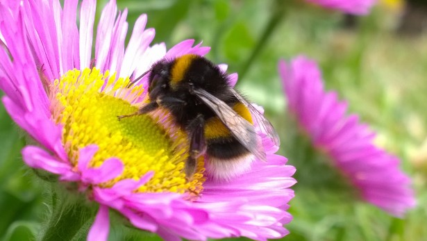

# Labelme .json to numpy array
This module converts Labelme created .json files to image and mask numpy arrays.

### Prerequisites

* Python 3
* numpy,matplotlib, PIL, io,opencv 3.4.1, scikit-image 0.14.0

## Author
Moe Rashidi
